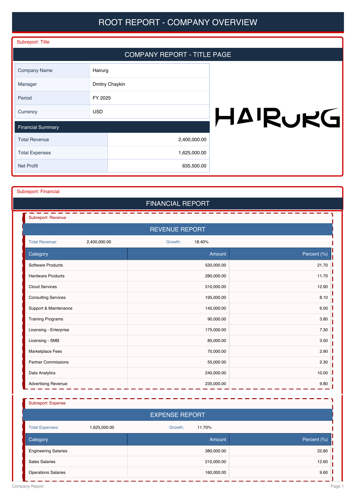
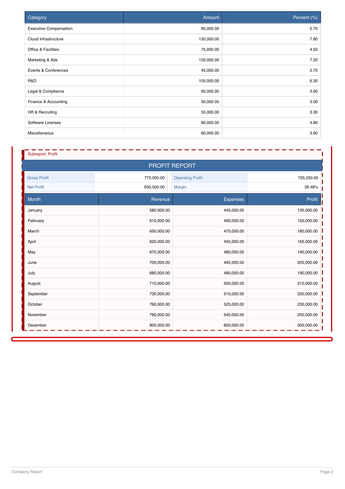

# jasper-modular-library

[](https://www.apache.org/licenses/LICENSE-2.0)
[](https://openjdk.org/)
[](https://spring.io/projects/spring-boot)
[](https://community.jaspersoft.com/)

**A Spring Boot library for simplifying and unifying JasperReports report development.**

Working with JasperReports in Java projects is hard. Passing data into templates is fragile and
awkward, approaches vary wildly between projects, and any non-trivial report quickly devolves into
a mess of SQL in XML, manual parameter mapping, and repetitive boilerplate.

The only realistic way to tame this complexity is modularity. When a report is assembled from
reusable subreport components — each with its own data and design — the structure becomes clear and
manageable. But the problem is that working with subreports directly in JasperReports is no easier.
There is no built-in mechanism that makes it simple and logical: you have to manually declare
parameters in the root report's JRXML, keep them in sync with Java code, pass each parameter by
name — and update everything in multiple places on every change.

jasper-modular solves both problems at once — the data chaos and the subreport complexity. You
simply declare a subreport as a field in a Java class and annotate it — the processor generates the
required parameters in the JRXML at compile time, and the runtime passes everything automatically.
Data is described as plain Java objects, and JRXML contains only design.

**What makes this different**

In standard JasperReports, subreport data is typically passed parameter-by-parameter: every field
the subreport needs must be declared individually in the parent JRXML and wired by hand — one
`<subreportParameter>` per field, one `params.put()` per field in Java. With many subreports this
quickly becomes dozens of manual entries across multiple files.

jasper-modular uses a different technique: every subreport always receives exactly two parameters —
the compiled report object (`<prefix>Report`) and a single `Map<String, Object>`
(`<prefix>MapParameter`) containing all of the subreport's data. Inside the subreport, the map
is automatically unpacked into individual parameters by JasperReports' built-in
`REPORT_PARAMETERS_MAP` mechanism. This is a little-known JasperReports capability that eliminates
parameter-by-parameter drilling entirely.

Both parameters are generated automatically from your Java class fields at compile time: you never
declare them, you never wire them, you never think about them. By the time you open the template in
Jaspersoft Studio, the parameters are already there. You just use your data.

---

## The problem this solves

Working with JasperReports is painful overall — handling data and passing it correctly into
templates is difficult at every level. Modularity through subreports is the best way to bring order
to this, but there is no standard mechanism for working with them conveniently. Every project solves
it differently, and almost every approach carries its own set of problems:

**One giant JSON for everything** — data is serialized into a single massive JSON object and passed
to all subreports via `JsonDataSource`. Subreports extract the data they need using JSON paths
directly in JRXML. Data-selection logic ends up in XML templates, which makes debugging extremely
painful.

**Direct SQL connection** — the subreport receives `REPORT_CONNECTION` (the same JDBC connection as
the root report) and executes its own SQL query. Data is filtered through parameters passed down
from the root report. Business logic and SQL accumulate inside JRXML.

**Passing `REPORT_DATA_SOURCE` directly** — the root report's data source is forwarded to the
subreport. A data source is a consumable object — it can only be used once, after which it is
exhausted. This causes subtle, hard-to-trace bugs.

**Manual parameter drilling through a cascade of subreports** — each subreport parameter is declared
individually in the root report's JRXML and mapped by hand. With many subreports this means dozens
of `<subreportParameter>` entries per template. Adding a new field requires updating three places:
the Java class, the root JRXML, and the subreport JRXML — drift and typos are inevitable.

**With jasper-modular:**

- A root report is just a Java class annotated with `@JasperModularReport`
- A subreport is just a field in that class annotated with `@JasperSubreport`
- The annotation processor generates all parameters and datasets in the JRXML at compile time
- The runtime compiles, fills, and assembles the entire report — including all subreports and their
  data — no manual boilerplate
- All data is passed through typed POJO-DTOs — JRXML contains only design
- Building individual report components and reusing them across reports becomes simple and natural

---

## Requirements

- Java 17+
- Spring Boot 3.3+ / 4.x
- JasperReports 6.x or 7.x

---

## Installation

Add the starter — it pulls in everything except JasperReports itself, which you provide:

```xml
<dependency>
    <groupId>io.github.hhdevr</groupId>
    <artifactId>jasper-modular-starter</artifactId>
    <version>2.0.0</version>
</dependency>

<dependency>
    <groupId>net.sf.jasperreports</groupId>
    <artifactId>jasperreports</artifactId>
    <version>${your.jasperreports.version}</version>
</dependency>
```

Add the annotation processor to the compiler plugin (required for JRXML generation). Pass your
JasperReports version alongside it so the processor can use the correct API at compile time:

```xml
<plugin>
    <groupId>org.apache.maven.plugins</groupId>
    <artifactId>maven-compiler-plugin</artifactId>
    <configuration>
        <annotationProcessorPaths>
            <path>
                <groupId>io.github.hhdevr</groupId>
                <artifactId>jasper-modular-processor</artifactId>
                <version>2.0.0</version>
            </path>
            <path>
                <groupId>net.sf.jasperreports</groupId>
                <artifactId>jasperreports</artifactId>
                <version>${your.jasperreports.version}</version>
            </path>
        </annotationProcessorPaths>
    </configuration>
</plugin>
```

For PDF export, add the JasperReports PDF extension (intentionally excluded from the starter):

```xml
<dependency>
    <groupId>net.sf.jasperreports</groupId>
    <artifactId>jasperreports-pdf</artifactId>
    <version>${your.jasperreports.version}</version>
</dependency>
```

---

## Quick start

### 1. Create a subreport module

```java
@Getter
@Setter
@JasperSubreport(templatePath = "/reports/sub_items.jrxml", prefix = "Items")
public class ItemsModule extends SubreportModule {

    private List<LineItem> items;
    private BigDecimal subtotal;

    @Override
    public boolean isEmpty() { return items == null || items.isEmpty(); }
}
```

### 2. Create the root report

```java
@Getter
@Setter
@JasperModularReport(templatePath = "/reports/invoice.jrxml")
public class InvoiceReport extends ModularReport {

    private String customerName;
    private String invoiceNumber;
    private BigDecimal total;
    private ItemsModule itemsModule;
}
```

### 3. Build the report and render it

```java
ItemsModule items = new ItemsModule(lineItems, subtotal);

InvoiceReport report = new InvoiceReport();
report.setCustomerName("Acme Corp");
report.setInvoiceNumber("INV-001");
report.setTotal(BigDecimal.valueOf(1500.00));
report.setItemsModule(items);

JasperPrint print = new JasperModularRenderer<>().render(report);
```

### 4. Export to PDF

```java
ByteArrayOutputStream out = new ByteArrayOutputStream();
JRPdfExporter exporter = new JRPdfExporter();
exporter.setExporterInput(new SimpleExporterInput(print));
exporter.setExporterOutput(new SimpleOutputStreamExporterOutput(out));
exporter.exportReport();

byte[] pdf = out.toByteArray();
```

---

## Full example

The [jasper-modular-sample](https://github.com/hhdevr/jasper-modular-sample) project demonstrates
a complete financial report built with the library. The report is assembled from nested reusable
modules:

```
CompanyReport (@JasperModularReport)
├── TitleSubModule (@JasperSubreport)
│   └── companyDetails, period, currency, totals
└── FinancialSubModule (@JasperSubreport)
    ├── RevenueSubModule (@JasperSubreport)
    │   └── totalRevenue, growthPercent, List<RevenueItem>
    ├── ExpenseSubModule (@JasperSubreport)
    │   └── totalExpenses, growthPercent, List<ExpenseItem>
    └── ProfitSubModule (@JasperSubreport)
        └── grossProfit, operatingProfit, netProfit, margin, List<ProfitBreakdown>
```

Each module is a standalone class with its own JRXML template. The root report simply declares them
as fields — everything else is handled automatically.

**Result:**

<p>
  
  
</p>

[Download full PDF](docs/financial_report.pdf)

---

## Data philosophy

The library intentionally uses **POJO-DTOs** as the only way to pass data into a report.

This means you do not write SQL queries inside JRXML and do not transform data into JSON. You
retrieve data from the database using any approach you prefer (JPA, JDBC, external API), perform all
necessary calculations and mapping in plain Java code, and pass the ready objects to the report.

```java
// Fetch data as usual
List<RevenueItem> items = revenueRepository.findByPeriod(period);
double total = items.stream().mapToDouble(RevenueItem::getAmount).sum();
double growth = calculateGrowth(items);

// Build the module — no SQL in the template
RevenueModule revenue = new RevenueModule(total, growth, items);
```

Benefits of this approach:

- **Readability** — the data structure is described by Java fields, not SQL in XML
- **Control** — all calculations, formatting, and business logic happen in Java before rendering
- **Type safety** — the compiler and IDE prevent typos in field names
- **Testability** — the report model is a plain POJO, easily testable without rendering a PDF

---

## How it works

### At compile time

The annotation processor (`JrxmlGeneratorProcessor`) runs during `mvn compile` and inspects all
classes annotated with `@JasperModularReport` and `@JasperSubreport`. For each class it:

1. Reads all non-ignored fields via the Java Compiler API
2. Identifies subreport fields, collection fields, and scalar fields
3. Injects missing elements into the existing JRXML template:
    - `<parameter>` for each field
    - `<dataset>` and a `list` or `table` component for each `Collection<T>` field
    - Subreport bands in the `<detail>` section for each subreport field
4. Writes the updated JRXML to `target/generated-sources`

Existing elements are detected by name and never overwritten — custom layout, styles, and
expressions created in Jaspersoft Studio are always preserved.

### At runtime

When `render(module)` is called:

1. The template is compiled from the JRXML resource (or retrieved from the in-memory cache)
2. All fields are traversed via reflection to build the `Map<String, Object>` parameters map
3. Subreport fields are recursively compiled and filled, injecting `<prefix>Report` and
   `<prefix>MapParameter`
4. Collection fields are wrapped in `JRBeanCollectionDataSource`
5. `JasperFillManager.fillReport()` is called with the parameters map and an empty data source
6. The resulting `JasperPrint` is returned for export to any format

Circular subreport dependencies (e.g. `A -> B -> A`) are detected automatically and throw a
`JasperModularException` with a clear message identifying the offending class, rather than
propagating a `StackOverflowError`.

### Startup precompilation

On application startup, `JasperReportPrecompiler` scans the configured base package and precompiles
all report templates, storing them in the shared `JasperModularCompiler.CACHE`. This eliminates
compilation latency on the first report request in production.

If any template fails to compile, the error is logged and the exception is rethrown — the
application will not start with broken report templates.

---

## Working with JRXML templates

### New report — CREATE mode

When you create a new report class with `mode = GenerationMode.CREATE` and run `mvn compile`, a
ready-to-use JRXML file appears in `target/generated-sources`. It already contains everything
needed:

- `<parameter>` for every field in the class
- `<dataset>` with fields for every collection
- A `list` or `table` component for displaying collection data
- Subreport bands in the `<detail>` section for every subreport field

**Your workflow:**

1. Open the generated file from `target/generated-sources` in Jaspersoft Studio
2. Add your design — place elements, configure fonts, colors, headers
3. Save the finished template to `src/main/resources/reports/`

All parameters, datasets, and subreports are already in place — you only need to add the design.

### Existing report — INJECT mode (default)

When you add a new field or a new subreport to an existing report class, the processor generates a
new file in `target/generated-sources` on the next compile. It contains your original template plus
only the missing elements — new parameters, datasets, subreports. Everything that was already in the
template is left untouched.

**Your workflow:**

1. Add a field to the Java class
2. Run `mvn compile`
3. Open the updated file from `target/generated-sources` in Jaspersoft Studio — the new parameters
   are there
4. Place the new elements in the design and copy the file back to `src/main/resources/reports/`

### Overall flow

```
                    mvn compile
                        |
        +---------------+---------------+
        |                               |
   new class                    existing class
   mode = CREATE                mode = INJECT (default)
        |                               |
        v                               v
  blank template               your template + new
  + all parameters             parameters/datasets/
  + datasets                   subreports
  + list/table components
  + subreport bands
        |                               |
        +---------------+---------------+
                        v
              target/generated-sources/
                   your_report.jrxml
                        |
                        v
              Jaspersoft Studio — add (CREATE) or update (INJECT) your design
                        |
                        v
              src/main/resources/reports/
                   your_report.jrxml  ← final template
```

---

## Generation modes

| Mode               | Behavior                                                                            |
|--------------------|-------------------------------------------------------------------------------------|
| `INJECT` (default) | Injects missing elements into the existing JRXML without touching existing content  |
| `CREATE`           | Creates a new JRXML from a blank design, overwriting any existing file              |
| `NONE`             | No processing — manage the JRXML entirely by hand                                   |

```java
@JasperModularReport(
        templatePath = "/reports/invoice.jrxml",
        mode = GenerationMode.CREATE
)
```

---

## Configuration

```yaml
jasper:
  modular:
    precompile-enabled: true           # default: true
    base-package: com.example.reports  # required for precompilation
```

| Property                            | Default | Description                        |
|-------------------------------------|---------|------------------------------------|
| `jasper.modular.precompile-enabled` | `true`  | Compile all templates at startup   |
| `jasper.modular.base-package`       | `""`    | Package to scan for report classes |

---

## Annotations reference

### `@JasperModularReport`

Marks a class as a root report. The class must extend `ModularReport`.

| Attribute      | Type              | Required | Description                             |
|----------------|-------------------|----------|-----------------------------------------|
| `templatePath` | `String`          | Yes      | Classpath path to the JRXML file        |
| `mode`         | `GenerationMode`  | No       | Generation strategy (default: `INJECT`) |
| `orientation`  | `PageOrientation` | No       | Page orientation (default: `PORTRAIT`)  |

### `@JasperSubreport`

Marks a class as a subreport module. The class must extend `SubreportModule`.

| Attribute      | Type              | Required | Description                                        |
|----------------|-------------------|----------|----------------------------------------------------|
| `templatePath` | `String`          | Yes      | Classpath path to the JRXML file                   |
| `prefix`       | `String`          | No       | Parameter name prefix (default: simple class name) |
| `mode`         | `GenerationMode`  | No       | Generation strategy (default: `INJECT`)            |
| `orientation`  | `PageOrientation` | No       | Page orientation (default: `PORTRAIT`)             |

### `@JasperCollection`

Controls the JRXML component type for a collection field.

| Attribute     | Type                      | Required | Description                                 |
|---------------|---------------------------|----------|---------------------------------------------|
| `type`        | `CollectionComponentType` | No       | `LIST` or `TABLE` (default: `TABLE`)        |
| `columnWidth` | `int`                     | No       | Pixel width of each column (default: `100`) |

When `@JasperCollection` is absent, the processor defaults to a `list` component for backwards
compatibility.

```java
@JasperCollection(type = CollectionComponentType.TABLE, columnWidth = 80)
private List<LineItem> items;
```

### `@JasperIgnore`

Place on any field to exclude it from JRXML generation and runtime filling.

```java
@JasperIgnore
private transient String internalState;
```

---

## Module structure

```
jasper-modular-parent
├── jasper-modular-core              — annotations, contracts, base classes, renderer
├── jasper-modular-autoconfigure     — Spring Boot autoconfiguration and precompiler
├── jasper-modular-processor         — annotation processor (JasperReports 6.x and 7.x)
└── jasper-modular-starter           — single dependency entry point
```

---

## Exporting to other formats

`JasperModularRenderer.render()` returns a format-neutral `JasperPrint`. Add the exporter for the
format you need:

**XLSX:**

```xml
<dependency>
    <groupId>net.sf.jasperreports</groupId>
    <artifactId>jasperreports-excel-poi</artifactId>
    <version>${your.jasperreports.version}</version>
</dependency>
```

Then use `JRXlsxExporter` or any other exporter from JasperReports. HTML export is available from
the core `jasperreports` jar without any additional dependency.

---

## License

Apache License 2.0 — see [LICENSE](LICENSE).

---

[](https://scarf.sh)
