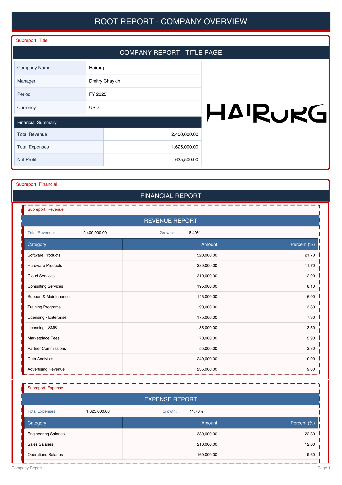
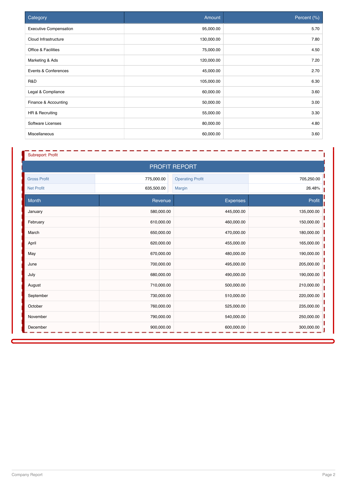

# jasper-modular-library

[](https://www.apache.org/licenses/LICENSE-2.0)
[](https://openjdk.org/)
[](https://spring.io/projects/spring-boot)
[](https://community.jaspersoft.com/)

**Spring Boot библиотека для упрощения и унификации работы с JasperReports отчётами.**

jasper-modular привносит модульность в JasperReports: отчёт собирается из переиспользуемых
компонентов-субрепортов, каждый из которых объявляется как аннотированное поле в Java-классе.
Процессор сам генерирует нужные параметры в JRXML при компиляции, рантайм сам передаёт всё что
нужно — данные описываются обычными Java-объектами, а JRXML содержит только дизайн.

**Чем это отличается от всего остального**

В стандартном JasperReports данные в субрепорт передаются поштучно: каждое поле нужно отдельно
объявить в JRXML родительского отчёта и прокинуть вручную — по одному `<subreportParameter>` на
поле, по одному `params.put()` на поле в Java. При большом количестве субрепортов это превращается
в десятки ручных записей в нескольких файлах.

jasper-modular использует другой приём: одиночный встроенный субрепорт получает ровно два параметра —
скомпилированный объект отчёта (`<prefix>Report`) и единую `Map<String, Object>`
(`<prefix>MapParameter`), содержащую все данные субрепорта. Внутри субрепорта мапа автоматически
распаковывается в отдельные параметры через встроенный механизм JasperReports
`REPORT_PARAMETERS_MAP` — малоизвестную возможность, которая полностью устраняет поштучный дриллинг
параметров. `List` модулей-субрепортов рендерится иначе — как повторяемый субрепорт, по одному
инстансу на элемент (см. [Списки субрепортов](#списки-субрепортов)).

Оба параметра формируются автоматически из полей Java-класса во время компиляции: вы их не
объявляете и не прокидываете. К тому моменту как вы открываете шаблон в Jaspersoft Studio, они уже
на месте.

---

## Какую проблему решает

Каждый проект решает работу с субрепортами по-своему, и почти каждый подход порождает свои
проблемы:

**Единый JSON на всех** — данные сериализуются в один гигантский JSON-объект, который передаётся во
все субрепорты через `JsonDataSource`, а те вытаскивают нужное через JSON-путь прямо в JRXML; логика
выборки данных уходит в XML-шаблон, и отлаживать это крайне тяжело.

**Прямое SQL-подключение** — субрепорт получает `REPORT_CONNECTION` и сам делает SQL-запрос, поэтому
бизнес-логика и SQL оседают в JRXML.

**Передача `REPORT_DATA_SOURCE` напрямую** — корневой датасорс пробрасывается в субрепорт, но
датасорс — consumable объект, используется один раз, после чего теряет данные, что порождает
трудноуловимые баги.

**Дриллинг параметров вручную через каскад субрепортов** — каждый параметр объявляется и маппится
вручную, поэтому добавление одного поля требует обновить три места (Java-класс, JRXML корневого
отчёта, JRXML субрепорта) — рассинхронизация и опечатки неизбежны.

**С jasper-modular:**

- Корневой отчёт — это просто Java-класс с аннотацией `@JasperModularReport`
- Субрепорт — это просто поле в Java-классе с аннотацией `@JasperSubreport`
- Аннотационный процессор сам генерирует все параметры и датасеты в JRXML при компиляции
- Рантайм сам компилирует, заполняет и собирает весь отчёт целиком — включая все субрепорты и их
  данные — никакого ручного boilerplate
- Все данные передаются через типизированные POJO-DTO — JRXML содержит только дизайн
- Соберите компонент один раз и вставляйте в любой отчёт как поле

---

## Требования

- Java 17+
- Spring Boot 3.3+ / 4.x
- JasperReports 6.x или 7.x

---

## Подключение

Добавьте стартер — он подтягивает всё необходимое кроме самого JasperReports, который вы указываете
сами:

```xml
<dependency>
    <groupId>io.github.hhdevr</groupId>
    <artifactId>jasper-modular-starter</artifactId>
    <version>2.0.1</version>
</dependency>

<dependency>
    <groupId>net.sf.jasperreports</groupId>
    <artifactId>jasperreports</artifactId>
    <version>${your.jasperreports.version}</version>
</dependency>
```

Добавьте аннотационный процессор в плагин компилятора (обязательно для генерации JRXML). Передайте
вашу версию JasperReports рядом — процессор использует её API во время компиляции:

```xml
<plugin>
    <groupId>org.apache.maven.plugins</groupId>
    <artifactId>maven-compiler-plugin</artifactId>
    <configuration>
        <annotationProcessorPaths>
            <path>
                <groupId>io.github.hhdevr</groupId>
                <artifactId>jasper-modular-processor</artifactId>
                <version>2.0.1</version>
            </path>
            <path>
                <groupId>net.sf.jasperreports</groupId>
                <artifactId>jasperreports</artifactId>
                <version>${your.jasperreports.version}</version>
            </path>
        </annotationProcessorPaths>
    </configuration>
</plugin>
```

Для экспорта в PDF добавьте расширение JasperReports (не включено в стартер намеренно):

```xml
<dependency>
    <groupId>net.sf.jasperreports</groupId>
    <artifactId>jasperreports-pdf</artifactId>
    <version>${your.jasperreports.version}</version>
</dependency>
```

---

## Быстрый старт

### 1. Создайте модуль субрепорта

```java
@Getter
@Setter
@JasperSubreport(templatePath = "/reports/sub_items.jrxml", prefix = "Items")
public class ItemsModule extends SubreportModule {

    private List<LineItem> items;
    private BigDecimal subtotal;

    @Override
    public boolean isEmpty() {return items == null || items.isEmpty();}
}
```

### 2. Создайте корневой отчёт

```java
@Getter
@Setter
@JasperModularReport(templatePath = "/reports/invoice.jrxml")
public class InvoiceReport extends ModularReport {

    private String customerName;
    private String invoiceNumber;
    private BigDecimal total;
    private ItemsModule itemsModule;
}
```

### 3. Соберите данные и отрендерьте отчёт

```java
ItemsModule items = new ItemsModule(lineItems, subtotal);

InvoiceReport report = new InvoiceReport();
report.setCustomerName("Acme Corp");
report.setInvoiceNumber("INV-001");
report.setTotal(BigDecimal.valueOf(1500.00));
report.setItemsModule(items);

JasperPrint print = new JasperModularRenderer().render(report);
```

### 4. Экспортируйте в PDF

```java
ByteArrayOutputStream out = new ByteArrayOutputStream();
JRPdfExporter exporter = new JRPdfExporter();
exporter.setExporterInput(new SimpleExporterInput(print));
exporter.setExporterOutput(new SimpleOutputStreamExporterOutput(out));
exporter.exportReport();

byte[] pdf = out.toByteArray();
```

---

## Полный пример

Проект [jasper-modular-sample](https://github.com/hhdevr/jasper-modular-sample) демонстрирует
полноценный финансовый отчёт, построенный с помощью библиотеки. Отчёт собирается из вложенных
переиспользуемых модулей:

```
CompanyReport (@JasperModularReport)
├── TitleSubModule (@JasperSubreport)
│   └── companyDetails, period, currency, totals
└── FinancialSubModule (@JasperSubreport)
    ├── RevenueSubModule (@JasperSubreport)
    │   └── totalRevenue, growthPercent, List<RevenueItem>
    ├── ExpenseSubModule (@JasperSubreport)
    │   └── totalExpenses, growthPercent, List<ExpenseItem>
    └── ProfitSubModule (@JasperSubreport)
        └── grossProfit, operatingProfit, netProfit, margin, List<ProfitBreakdown>
```

Каждый модуль — самостоятельный класс со своим JRXML-шаблоном. Корневой отчёт объявляет
их как поля; процессор прокидывает параметры, а рендерер собирает документ.

**Результат:**

<p>
  
  
</p>

[Скачать полный PDF](docs/financial_report.pdf)

---

## Философия работы с данными

Библиотека намеренно использует **POJO-DTO** как единственный способ передачи данных в отчёт —
никакого SQL в JRXML, никакого JSON. Вы получаете данные любым удобным способом (JPA, JDBC, внешний
API), выполняете все вычисления и маппинг в обычном Java-коде, и передаёте готовые объекты в отчёт.

```java
// Получаете данные как обычно
List<RevenueItem> items = revenueRepository.findByPeriod(period);
double total = items.stream().mapToDouble(RevenueItem::getAmount).sum();
double growth = calculateGrowth(items);

// Собираете модуль — никакого SQL в шаблоне
RevenueModule revenue = new RevenueModule(total, growth, items);
```

Что это даёт: структура данных живёт в полях Java-класса, а не в SQL внутри XML; все вычисления и
форматирование выполняются в обычном коде до рендера. Компилятор ловит опечатки в именах полей, а
модель отчёта остаётся POJO, который тестируется без генерации PDF.

---

## Как это работает

### Во время компиляции

Аннотационный процессор (`JrxmlGeneratorProcessor`) запускается во время `mvn compile`, инспектирует
все классы, аннотированные `@JasperModularReport` и `@JasperSubreport`, и вставляет недостающие
элементы в существующий шаблон JRXML:

- `<parameter>` для каждого поля
- `<dataset>` и компонент `list` или `table` для каждого поля типа `Collection<T>`
- Bands с субрепортами в секции `<detail>` для каждого поля-субрепорта

Существующие элементы определяются по имени и никогда не перезаписываются — пользовательский layout,
стили и выражения, созданные в Jaspersoft Studio, всегда сохраняются.

### В рантайме

При вызове `render(module)` шаблон компилируется из JRXML-ресурса (или берётся из кэша), и все поля
обходятся через рефлексию для формирования `Map<String, Object>` параметров. Поля-субрепорты
рекурсивно компилируются и заполняются, добавляя `<prefix>Report` и `<prefix>MapParameter`.
Поля-коллекции кладутся в карту как значения `JRBeanCollectionDataSource`. Это **параметры**, а не
корневой источник данных: в JRXML ссылайтесь на них через `$P{fieldName}` в `<dataSourceExpression>`
компонента `list` или `table`. Заполнение идёт через `JasperFillManager.fillReport()` с
`JREmptyDataSource` в качестве корневого источника (библиотека не использует band-iteration
источники) и возвращает `JasperPrint` для экспорта в любой формат.

Циклические зависимости между субрепортами (например `A -> B -> A`) обнаруживаются автоматически —
выбрасывается `JasperModularException` с указанием проблемного класса, вместо `StackOverflowError`.

### Прекомпиляция при старте

При запуске `JasperReportPrecompiler` сканирует указанный пакет и прекомпилирует все шаблоны в общий
`JasperModularCompiler.CACHE`, исключая задержку компиляции на первый запрос. Если какой-либо шаблон
не компилируется — исключение пробрасывается дальше, и приложение не запустится со сломанными
шаблонами отчётов.

---

## Работа с шаблонами JRXML

### Новый отчёт — режим CREATE

С `mode = GenerationMode.CREATE` команда `mvn compile` создаёт в `target/generated-sources` готовый
JRXML-файл со всем необходимым — `<parameter>` для каждого поля, `<dataset>` и компонент
`list`/`table` для каждой коллекции, и bands с субрепортами для каждого поля-субрепорта. Откройте его
в Jaspersoft Studio, добавьте дизайн (элементы, шрифты, цвета, заголовки) и сохраните готовый шаблон
в `src/main/resources/reports/`.

### Существующий отчёт — режим INJECT (по умолчанию)

Когда вы добавляете поле или субрепорт в существующий класс отчёта, следующая `mvn compile`
записывает в `target/generated-sources` файл с вашим оригинальным шаблоном плюс только недостающими
элементами — всё что уже было в шаблоне остаётся нетронутым. Откройте его в Jaspersoft Studio,
разместите новые элементы в дизайне и верните файл в `src/main/resources/reports/`.

---

## Режимы генерации

| Режим                   | Поведение                                                               |
|-------------------------|-------------------------------------------------------------------------|
| `INJECT` (по умолчанию) | Вставляет недостающие элементы в JRXML не трогая остальное              |
| `CREATE`                | Создаёт новый JRXML из пустого шаблона, перезаписывая существующий файл |
| `NONE`                  | Генерация не выполняется — управляйте JRXML полностью вручную           |

```java
@JasperModularReport(
        templatePath = "/reports/invoice.jrxml",
        mode = GenerationMode.CREATE
)
```

---

## Конфигурация

```yaml
jasper:
  modular:
    precompile-enabled: true           # по умолчанию: true
    base-package: com.example.reports  # обязательно для прекомпиляции
```

| Свойство                            | По умолчанию | Описание                               |
|-------------------------------------|--------------|----------------------------------------|
| `jasper.modular.precompile-enabled` | `true`       | Компилировать все шаблоны при старте   |
| `jasper.modular.base-package`       | `""`         | Пакет для сканирования классов отчётов |

---

## Справочник аннотаций

### `@JasperModularReport`

Помечает класс как корневой отчёт. Класс должен наследовать `ModularReport`.

| Атрибут        | Тип               | Обязательно | Описание                                       |
|----------------|-------------------|-------------|------------------------------------------------|
| `templatePath` | `String`          | Да          | Путь к JRXML-файлу в classpath                 |
| `mode`         | `GenerationMode`  | Нет         | Стратегия генерации (по умолчанию: `INJECT`)   |
| `orientation`  | `PageOrientation` | Нет         | Ориентация страницы (по умолчанию: `PORTRAIT`) |

### `@JasperSubreport`

Помечает класс как модуль субрепорта. Класс должен наследовать `SubreportModule`.

| Атрибут        | Тип               | Обязательно | Описание                                                       |
|----------------|-------------------|-------------|----------------------------------------------------------------|
| `templatePath` | `String`          | Да          | Путь к JRXML-файлу в classpath                                 |
| `prefix`       | `String`          | Нет         | Префикс для имён параметров (по умолчанию: простое имя класса) |
| `mode`         | `GenerationMode`  | Нет         | Стратегия генерации (по умолчанию: `INJECT`)                   |
| `orientation`  | `PageOrientation` | Нет         | Ориентация страницы (по умолчанию: `PORTRAIT`)                 |

### `@JasperCollection`

Управляет типом JRXML-компонента для поля-коллекции.

| Атрибут       | Тип                       | Обязательно | Описание                                               |
|---------------|---------------------------|-------------|--------------------------------------------------------|
| `type`        | `CollectionComponentType` | Нет         | `LIST` или `TABLE` (по умолчанию: `TABLE`)             |
| `columnWidth` | `int`                     | Нет         | Ширина каждой колонки в пикселях (по умолчанию: `100`) |

Тип компонента по умолчанию — `TABLE`, независимо от того, присутствует аннотация (без явного
`type`) или отсутствует совсем. Для компонента `list` укажите `type = CollectionComponentType.LIST`.

```java
@JasperCollection(type = CollectionComponentType.TABLE, columnWidth = 80)
private List<LineItem> items;
```

### Списки субрепортов

Способ рендера поля-`List` полностью зависит от **типа элемента** — два случая жёстко разделены:

| Тип элемента                | Рендерится как                                            | Аннотация на поле          |
|-----------------------------|-----------------------------------------------------------|----------------------------|
| Обычный класс данных (бин)  | Инлайн-компонент `list` / `table` в том же шаблоне        | `@JasperCollection` (опц.) |
| Модуль с `@JasperSubreport` | **Повторяемый субрепорт** — по одному инстансу на элемент | не нужна                   |

Если тип элемента — модуль с `@JasperSubreport`, список трактуется как настоящие субрепорты:
процессор впрыскивает повторяемый субрепорт в родительский шаблон, а в рантайме каждый элемент
рекурсивно заполняется в свою мапу параметров и рендерится один раз. Ручная проводка JRXML не
нужна, и `@JasperCollection` здесь не применяется.

```java
// Инлайн — элемент это обычный бин → list/table отчёта
@JasperCollection(type = CollectionComponentType.TABLE)
private List<LineItem> items;

// Повторяемый субрепорт — элемент это модуль с @JasperSubreport → рендерится по разу на элемент
private List<DepartmentModule> departments;
```

**Что выбрать:**

- Инлайн `list` / `table` — для простых табличных строк. Легковесно: один шаблон, без отдельной
  компиляции.
- Повторяемый субрепорт — когда каждый элемент это самодостаточная переиспользуемая секция со своей
  вёрсткой (или своей вложенностью / разрывом страницы).

Самоссылающийся модуль (класс с `@JasperSubreport`, содержащий `List` самого себя) отклоняется
защитой от циклических зависимостей.

### `@JasperIgnore`

Ставится на поле, чтобы исключить его из генерации JRXML и заполнения параметров.

```java
@JasperIgnore
private transient String internalState;
```

---

## Структура модулей

```
jasper-modular-parent
├── jasper-modular-core              — аннотации, контракты, базовые классы, рендерер
├── jasper-modular-autoconfigure     — Spring Boot автоконфигурация и прекомпилятор
├── jasper-modular-processor         — аннотационный процессор (JasperReports 6.x и 7.x)
└── jasper-modular-starter           — единственная зависимость для подключения
```

---

## Экспорт в другие форматы

`JasperModularRenderer.render()` возвращает формат-нейтральный `JasperPrint`. Добавьте нужный
экспортёр:

**XLSX:**

```xml
<dependency>
    <groupId>net.sf.jasperreports</groupId>
    <artifactId>jasperreports-excel-poi</artifactId>
    <version>${your.jasperreports.version}</version>
</dependency>
```

Затем используйте `JRXlsxExporter` или другой экспортёр из JasperReports. HTML экспорт доступен из
основного `jasperreports` jar без дополнительных зависимостей.

---

## Лицензия

Apache License 2.0 — см. [LICENSE](LICENSE).

---

[](https://scarf.sh)
